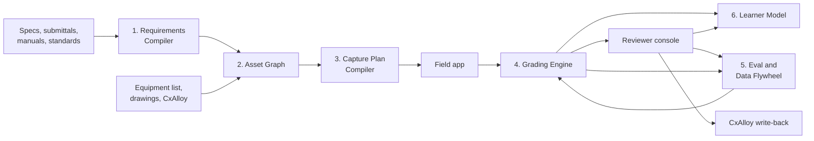
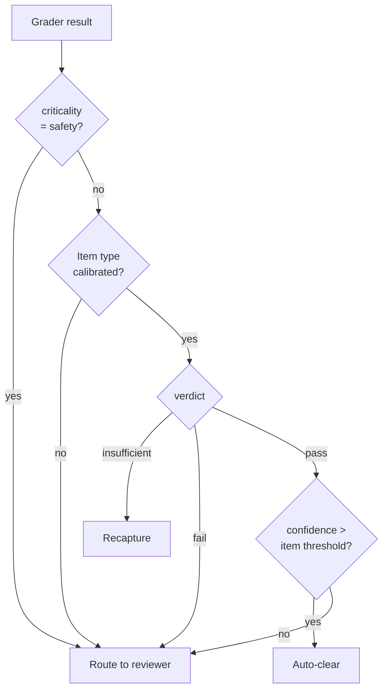
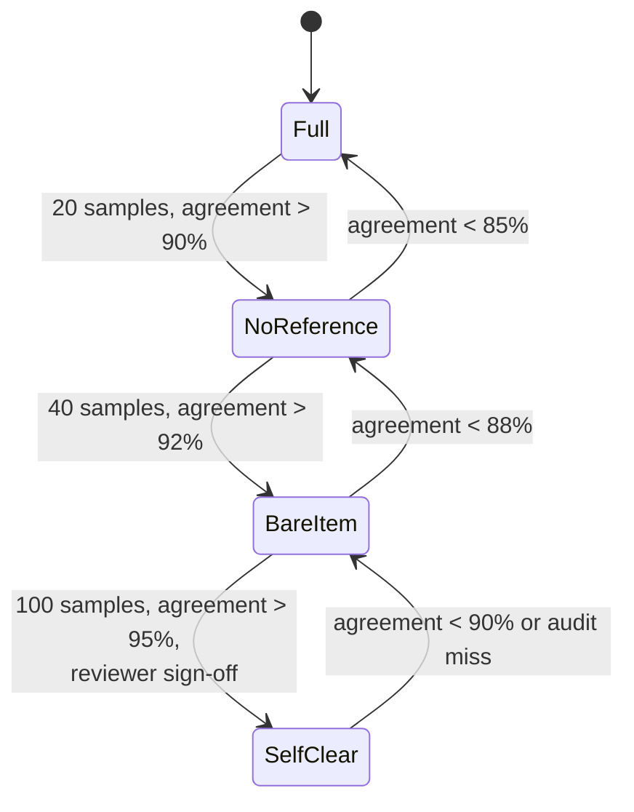

# Field Inspection Engine — Architecture

2026-09-17 · David Butler

## Purpose and design goals

The platform lets a small number of qualified inspectors supervise a much larger field force by guiding capture, auto-clearing routine items, and routing the rest for remote review. It also has to make each tech better on every walk so they eventually inspect without it.

Design goals, in priority order:

1. Throughput: one qualified reviewer covers 4 to 6 field techs. Measured as reviewer minutes per completed inspection.
2. Trust: nothing the tool auto-clears comes back as rework at a higher rate than a human inspection would. Measured as rework rate on auto-cleared items.
3. Training: techs gain self-clear authority per item type as their agreement with the tool and the reviewer holds up. Measured as items unlocked per tech per month.
4. Safety: energization and life-safety items always carry a qualified person's name. Non-negotiable.

The tool is an inspection assistant and a teaching loop, not an inspector of record.

## System overview

Six subsystems, joined by four core records: Requirement, Asset, ChecklistItem, and Evidence. Everything downstream of the Requirements Compiler is ordinary software; the LLM appears in exactly three places (extraction, visual grading, tech-facing explanations).

Reading it left to right: documents become requirements; requirements bind to physical assets and become checklist items; items become a guided walk; the walk produces evidence; graders score evidence and the policy layer decides auto-clear or route to reviewer; every reviewer ruling feeds both the learner model (for the tech) and the flywheel (for the graders); cleared results write back to the system of record.

| Subsystem | Owns | Deterministic or model | Hardest part |
| --- | --- | --- | --- |
| 1. Requirements Compiler | Requirement records, rule set versions | LLM extraction, deterministic precedence | Conflicts between documents; curation |
| 2. Asset Graph | Asset records, ChecklistItem instantiation | Deterministic + human reconciliation | Tag mismatch across sources |
| 3. Capture Plan Compiler | Walk sequences, capture recipes | Deterministic templates | Access and energization constraints |
| 4. Grading Engine | Grader registry, policy layer | VLM, OCR, detectors, lookups | Calibration, confident wrong answers |
| 5. Eval and Flywheel | Labeled examples, golden sets, release gate | Deterministic | Getting reviewers to label |
| 6. Learner Model | Competency scores, scaffolding state | Deterministic | Fair thresholds per item type |

## 1. Requirements Compiler

Turns the project's documents into a versioned, human-approved rule set. Extraction is the model's job; precedence and approval are code and people.

Pipeline:

1. Ingest: PDF to text plus layout (headings, tables, clause numbers). OCR for scanned submittals. Store the page image alongside the text so every requirement can show its source.
2. Classify: which document type (spec section, approved submittal, manufacturer IOM, standard, RFI response) and which equipment classes it governs.
3. Extract: LLM call per section with a strict JSON schema. One output per requirement. Anything the model cannot place gets `status: needs_review` rather than a guess.
4. Resolve precedence: deterministic rules. Contract documents over approved submittal over manufacturer IOM, except where a submittal was approved as a deviation, which wins for that item. RFI responses supersede whatever they answer. Conflicts that the rules cannot settle are surfaced, not resolved.
5. Curate: a qualified person reviews the compiled set in a side-by-side UI (requirement, source clause, page image), approves, edits, or rejects. Nothing with criticality `safety` goes live unapproved.
6. Version and publish: rule set gets a version. Checklist items record which version they were generated from. A spec revision produces a new version and a diff, not a silent overwrite.

Requirement schema:

| Field | Type | Notes |
| --- | --- | --- |
| id | uuid | Stable across versions where the requirement is unchanged |
| applies_to | equipment_class[], system, location_type | e.g. `switchboard`, `normal_power`, `electrical_room` |
| statement | text | Plain-language requirement as the tech will read it |
| verification_method | enum | `visual`, `measured`, `tested`, `documentary` |
| evidence_spec | reference to capture recipe | What must be captured to judge it |
| pass_criteria | structured | Tolerance, expected value, presence/absence, pattern |
| criticality | enum | `safety`, `contractual`, `quality` |
| source | doc id, clause, page | Always shown to tech and reviewer |
| precedence_rank | int | From the resolution step |
| why_it_matters | text | What fails in service if missed. Written or approved by a human |
| status | enum | `draft`, `needs_review`, `approved`, `retired` |
| ruleset_version | semver | |

Expect roughly 80% of requirements to extract cleanly. Budget curation time as a real cost per project: it is the step that makes the rule set trustworthy.

## 2. Asset Graph

Binds abstract requirements to physical equipment so the tech is standing at the right panel with the right checklist. This is mostly reconciliation code plus a human clearing the leftovers.

Sources of truth, in the order they are trusted for identity: the CxAlloy equipment list (or the model's asset register), then drawing schedules, then submittal tags, then the nameplate as read in the field. Tags will not match across these. The reconciler normalizes (case, separators, prefixes), matches on tag plus location plus equipment class, and holds anything below a match threshold in a reconciliation queue for a person.

Instantiation: for each approved requirement, for each asset whose class, system, and location type match, create one ChecklistItem. A 1,000-asset building with 40 requirements per class produces tens of thousands of items; generate them lazily per area as the capture plan needs them, not all upfront.

Asset schema:

| Field | Type | Notes |
| --- | --- | --- |
| id | uuid | |
| tag | text | Canonical tag after normalization |
| aliases | text[] | Every tag variant seen across sources |
| equipment_class | enum | Drives which requirements apply |
| system | text | e.g. normal power, UPS output, chilled water |
| location | room, grid ref, model coordinates | Model coordinates optional until scan integration |
| parent_asset | uuid | Feeds-from or houses relationship |
| cxalloy_id | text | For write-back |
| submittal_ids | uuid[] | Approved submittals governing this asset |
| reconciliation_status | enum | `auto_matched`, `human_confirmed`, `unresolved` |

ChecklistItem schema:

| Field | Type | Notes |
| --- | --- | --- |
| id | uuid | |
| asset_id, requirement_id | uuid | |
| ruleset_version | semver | Which rule set generated it |
| state | enum | `open`, `evidence_captured`, `auto_cleared`, `routed`, `reviewer_passed`, `reviewer_failed`, `blocked` |
| assigned_tech, reviewer | user ids | |
| evidence_ids | uuid[] | |
| grader_result_id | uuid | Latest grading |
| resolved_at, resolved_by | | |

The unresolved reconciliation queue is a leading indicator of trouble. If it grows faster than someone clears it, the field is walking to wrong assets.

## 3. Capture Plan Compiler

Turns a set of open checklist items into a guided walk the tech can execute without knowing what matters. Deterministic templates, not live LLM generation: the graders downstream depend on evidence looking the same every time.

Each verification method has a capture recipe. A recipe defines the required shots or measurements, framing rules (distance, angle, what must be in frame), disqualifiers (glare, obstruction, blur, missing reference), and an on-device gate that rejects the capture before the tech moves on. Recipes are versioned and shared across projects; the project-specific part is which recipe each requirement points to.

| Verification method | Typical recipe | Device gate |
| --- | --- | --- |
| visual, presence | 1 wide shot + 1 close shot of the item | Object detector confirms class present |
| visual, readable | Nameplate or label shot, perpendicular, fills 30%+ of frame | OCR returns text above confidence floor |
| measured | Photo with reference scale or LiDAR capture | Scale detected or depth data present |
| tested | Meter or instrument display + test setup shot | Reading parsed; setup shot present |
| documentary | Photo of signed form or reference to uploaded PDF | Document classifier matches expected form |

Routing: the compiler groups items by asset, then sequences assets by location and access constraints. Constraints come from the asset graph (room, level) and from the tech's declared state at the start of the walk (which rooms are open, what is energized, whether a ladder is available). Items behind a constraint the tech cannot satisfy are deferred with the reason recorded, not skipped silently.

Walk output per item: the requirement statement in plain words, the reference image or model view of a correct install, the capture steps, and the `why_it_matters` line. The learner model decides how much of that scaffolding this tech actually sees (section 6).

CaptureRecipe schema: `id`, `version`, `verification_method`, `steps[]` (each with `instruction`, `framing_rule`, `gate_check`), `disqualifiers[]`, `reference_media_slot`. Keep recipes small and composable; a requirement can reference more than one.

## 4. Grading Engine

A registry of typed graders, one per verification pattern, behind a single output contract, with a policy layer that turns grader output into a routing decision. Thresholds are derived from calibration data, never hardcoded.

Every grader returns the same record:

| Field | Type | Notes |
| --- | --- | --- |
| verdict | enum | `pass`, `fail`, `insufficient_evidence` |
| confidence | 0 to 1 | Grader's own estimate; calibrated downstream |
| evidence_used | evidence ids + regions | Bounding boxes or crops the verdict relied on |
| observed_value | structured | What was read or measured, so a reviewer can check the grader, not just the photo |
| expected_value | structured | From `pass_criteria` |
| explanation | text | One or two sentences for the tech, plain language |
| grader_id, grader_version, model_version | | For the eval harness |

Grader types at launch:

1. VLM question: structured-output call with the image, the requirement, and the reference. Prompt asks for observed value and a yes/no, never an open answer. Used for presence, correct component, condition, label format.
2. OCR and compare: read nameplate or label, normalize, compare to submittal or schedule value. Deterministic comparison; the model only reads.
3. Detector: small fine-tuned model for high-volume repetitive items (supports, labels, firestop collars). Added only once an item type has a few thousand labeled examples.
4. Scan lookup: query the deviation dataset from the scanning software for the asset and return the measured offset against tolerance. No geometry code of our own.
5. Document check: classify an uploaded form, extract fields, compare to expected.

Policy layer, evaluated per checklist item:

Calibration: for each item type, plot grader confidence against the reviewer's eventual ruling on a rolling window. Set the auto-clear threshold where the observed false-pass rate falls below the target for that criticality (a suggested starting target is under 1% for `contractual`, under 2% for `quality`; `safety` never auto-clears). An item type is `calibrated` only after a minimum sample size, say 200 reviewed examples. Thresholds recompute weekly and are logged.

The failure mode to design against is the confident wrong pass. Every auto-clear stores the grader record so a spot-check audit (section 5) can catch drift before the field does.

## 5. Evaluation and Data Flywheel

This is what makes the system an engine instead of a demo. Every reviewer decision becomes a labeled example; every grader change is tested against those examples before it ships.

LabeledExample schema: `evidence_ids`, `checklist_item_id`, `requirement_id`, `item_type`, `grader_result` (the full record from section 4), `human_verdict`, `human_note`, `reviewer_id`, `labeled_at`. Stored immutably. The tech's predict-then-reveal call is stored too, as a second label with lower weight.

Three jobs run on this data:

1. Calibration (weekly): recompute per-item-type thresholds as described in section 4.
2. Golden sets (curated): for each item type, a held-out set of 100 to 300 examples with confirmed verdicts, including deliberately hard cases. Any change to a prompt, model version, grader code, or detector runs against every golden set. A regression on any `safety` or `contractual` item type blocks the release. Results are logged per grader version.
3. Spot-check audit (continuous): a random 5% of auto-cleared items is silently routed to a reviewer anyway. Disagreement rate on this sample is the live measure of drift and is what tells you a model provider changed something under you.

Detector training: once an item type has roughly 2,000 labeled examples with good class balance, train a small detector, evaluate it against the golden set, and register it as a new grader version. It only replaces the VLM grader for that item type if it wins on the golden set and is cheaper or faster.

The flywheel dies if reviewers clear items without labeling. Design the reviewer console so the ruling and a one-line note are the same action, and report labeling rate per reviewer alongside their throughput.

## 6. Learner Model

Tracks each tech's competency per item type, fades the scaffolding as they earn it, and unlocks self-clear authority for non-safety items when their record supports it.

Core interaction is predict-then-reveal. Before the grader's result is shown, the tech marks pass or fail and picks a reason from a short list. The tool then shows its verdict and the source clause. Agreement and disagreement are both recorded. Disagreements go into a spaced repetition queue and resurface on a different asset of the same type after 2, 7, and 21 days.

Competency score per (tech, item_type): a rolling agreement rate with the final ruling (reviewer's where one exists, otherwise the calibrated grader's), weighted toward recent walks, with a minimum sample size before it counts. Store `samples`, `agreement_rate`, `last_disagreement_at`, `scaffold_level`, `self_clear_enabled`.

Scaffolding state machine per (tech, item_type):

`Full` shows the reference image, framing guide, statement, and why-it-matters. `NoReference` drops the reference image. `BareItem` shows only the checklist line and the capture gate. `SelfClear` lets the tech's own pass stand for that item type without grader routing, subject to the same 5% spot-check audit as auto-clear. Thresholds above are starting points; tune them from data.

Hard limits: `safety` items never reach `SelfClear` for anyone. Unlock to `SelfClear` requires a named reviewer's approval, not just the numbers. Demotion is automatic.

The competency record doubles as a qualification log. When someone asks how a two-year tech was allowed to sign a checklist item, the answer is a dated record of samples, agreement, audit results, and who approved the unlock.

## Sync and integrations

The field app is offline-first because a data hall under construction has no signal. The platform is not a system of record; it writes results to the one the project already uses.

Offline model: the app downloads the walk (checklist items, recipes, reference media) for the assigned area before the tech leaves signal. Captures are written to local storage with a client-generated id and an event log (item opened, prediction made, capture taken, gate passed or failed). On reconnect the event log syncs in order; the server applies events idempotently by client id, so a retried upload never duplicates evidence or double-writes to CxAlloy. Grading happens server-side after sync; the tech sees results on the next connection or at the end of the walk when back in signal.

Conflict rule: if a reviewer changed an item's state while the tech was offline, the reviewer's state wins and the tech's evidence is attached rather than applied. The tech is told what changed.

CxAlloy write-back: on `auto_cleared`, `reviewer_passed`, or `reviewer_failed`, update the corresponding checklist line, attach the evidence photos, and open an issue for failures with the grader's observed versus expected values in the description. Write-back is a separate queue with retries, so a CxAlloy outage never blocks the field. Confirm the API surface available on the CxAlloy plan before committing to this path; if write access is limited, a scheduled export import is the fallback.

Scan data: ingest deviation reports from the scanning software as a batch per scan milestone, keyed by asset tag and model element id. Store the measured offsets on the asset; the scan lookup grader reads from there. No point cloud processing in the platform itself.

## Technology stack

Boring and well-documented on purpose. AI-assisted development is strongest where the training data is deepest, and maintainers are easiest to find for these tools.

| Layer | Choice | Why |
| --- | --- | --- |
| Field app | React Native with Expo | One codebase for iOS and Android; good camera and offline libraries; crews already carry phones. Native ARKit module later for on-device LiDAR |
| Backend API | Python, FastAPI | Every ML, OCR, and point cloud library is Python-first; one language between API and model code |
| Database | Postgres with pgvector | Relational core for assets and items; pgvector for spec retrieval; PostGIS if location queries grow |
| Object storage | S3-compatible | Photos, scan clips, page images. Lifecycle rules to cold storage after project close |
| Job queue | Celery or Dramatiq on Redis | Grading, calibration, write-back, and detector training all run async |
| Document extraction | Vision-capable LLM via API, structured outputs | Extraction and visual grading; strict JSON schemas, no free text |
| Detectors | YOLO-family models, Roboflow or Ultralytics tooling | Only after labeled data exists; cheap to train and serve |
| Reviewer console | Next.js | Evidence by item, side-by-side observed versus expected, one-action ruling plus note |
| Point cloud viewer | Potree (browser) if reviewers need it | Viewing only; geometry analysis stays in the scanning software |
| Auth | Existing company SSO | Reviewer sign-offs need a real identity behind them |
| Observability | Structured logs plus a metrics store | Every grader call logged with version and latency; the eval harness reads from here |

Model providers will change under you. Keep the LLM behind a thin adapter with the prompt, schema, and model version pinned per grader version so the eval harness can compare providers on the golden sets before switching.

## Safety boundaries

These are enforced in the policy layer as code, not in training material.

- Any requirement with criticality `safety` routes to a qualified reviewer every time. No auto-clear, no self-clear, no threshold that changes this.
- `safety` covers at minimum: anything gating energization, arc-flash labeling and clearances, grounding and bonding, protective device settings, LOTO-related verifications, fire and life-safety systems, and confined-space or fall-protection conditions. The list is extended per project by the curator, never shortened.
- The reviewer's ruling on a `safety` item carries their identity and timestamp and cannot be edited after the fact; a correction is a new ruling.
- A tech's capture of a `safety` item is evidence for a qualified person's judgment, never the judgment itself. The UI wording reflects this.
- The 5% spot-check audit applies to `safety` items as well, run by a second reviewer, so that reviewer drift is caught too.
- If the grading engine or the policy layer is unavailable, the app degrades to capture-only. Nothing clears while the policy layer is down.

## Phased build plan and success metrics

Phase 1 ships without any computer vision. It solves the staffing problem on its own and generates the labeled data everything later depends on.

| Phase | Scope | What ships | Exit metric |
| --- | --- | --- | --- |
| 1. Guided capture | Compiler for one spec section and its submittals; asset graph from the CxAlloy list; capture recipes for visual and readable items; offline app; reviewer console; CxAlloy write-back | Tech walks a guided checklist; reviewer clears everything remotely | Reviewer minutes per inspection below the current qualified-inspector walk time; 1,000+ labeled examples |
| 2. Auto-clear | VLM and OCR graders; calibration job; golden sets; spot-check audit; predict-then-reveal in the app | Routine non-safety items clear automatically | 40%+ of items auto-cleared on calibrated types; false-pass rate under target on spot-check |
| 3. Learner and scale | Competency scoring; scaffolding fade; self-clear unlock with reviewer approval; second equipment class | Techs earn authority per item type | One reviewer sustaining 4+ techs; first self-clear unlocks |
| 4. Scan and detectors | Deviation report ingest; scan lookup grader; first fine-tuned detector for the highest-volume item | Dimensional items graded from scan data | Measured items routed without a tape in hand |

Run the pilot on one equipment class in one building with two techs and one reviewer. Pick the class costing the most rework or the one you are shortest on people for.

Metrics tracked from day one: reviewer minutes per inspection, inspections per tech per day, auto-clear rate, spot-check disagreement rate, rework rate on cleared items, labeling rate per reviewer, and reconciliation queue size.

## Known hard problems and open questions

The three places this kind of project usually dies are tag reconciliation, calibration data that never gets collected, and no eval harness to notice drift. Everything below is either one of those or a decision still to make.

| Problem | Why it is hard | Current position |
| --- | --- | --- |
| Document conflicts | Spec, submittal, IOM, and RFIs disagree; implicit requirements are not written anywhere | Precedence rules plus mandatory human curation; accept curation as a real per-project cost |
| Tag reconciliation | Same equipment has different tags in schedule, submittal, CxAlloy, and nameplate | Alias table plus reconciliation queue; queue size is a tracked metric |
| Confident wrong pass | VLMs answer fluently when they should say insufficient evidence | Structured output with `insufficient_evidence` as a first-class verdict; calibration; spot-check audit |
| Reviewer labeling | Reviewers clear silently under time pressure and the flywheel starves | Ruling and note are one action; labeling rate reported per reviewer |
| Offline correctness | Retries and conflicts duplicate evidence or overwrite reviewer rulings | Client ids, idempotent event replay, reviewer-wins conflict rule |
| Model drift | Provider updates change behaviour without notice | Pinned model versions per grader; golden set gate; provider adapter |
| Scan registration | Point cloud, model, and phone imagery in different coordinate frames | Deferred to Phase 4; consume deviation reports rather than raw clouds |
| Liability | Who is accountable for an auto-cleared item that fails | Safety items never auto-clear; every clear stores the grader record; qualification log per tech |

Open questions to settle before Phase 1:

- [ ] Which equipment class and building for the pilot
- [ ] CxAlloy API access level on the current plan, and whether write-back or export-import
- [ ] Who curates the first rule set and how many hours they have
- [ ] Target false-pass rates per criticality, agreed with whoever signs off on quality
- [ ] Whether the reviewer role sits with the project or a central team covering several sites
- [ ] Ownership of the platform: internal tool, or a product that outlives the project
